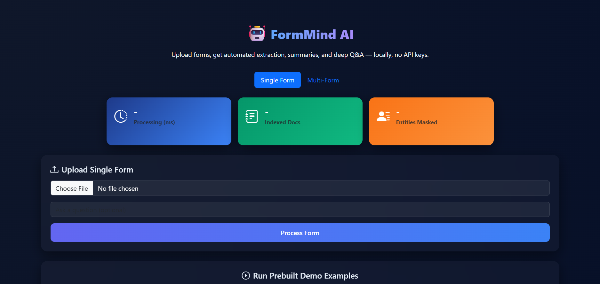
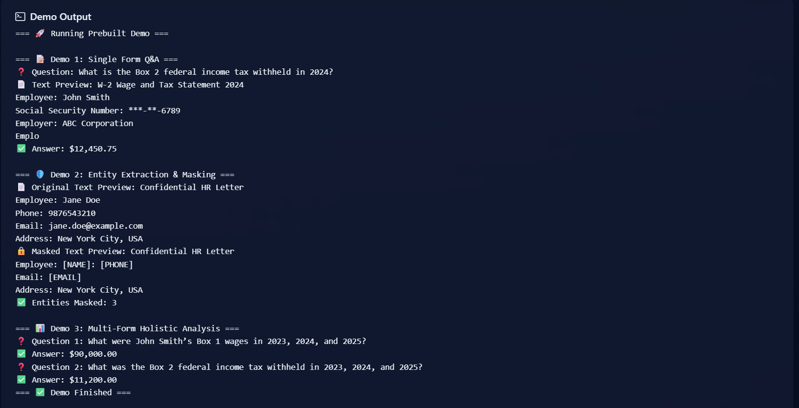

# 🤖 FormMind AI – Intelligent Form Agent  

 

##  Project Overview
**FormMind AI** is an **Intelligent Form Agent** that can read, extract, and understand diverse forms (PDFs). It automates manual document review by:  

- Extracting both structured + unstructured fields.  
- Answering natural language questions from a single form.  
- Summarizing large documents into concise insights.  
- Providing **holistic analysis** across multiple forms.  
- Masking sensitive information (PII redaction).  

This project extends beyond the base requirements with **novel features** like a professional **web UI**, statistics dashboard, and a deployment-ready API.

---

##  Technical Stack
- **Backend:** FastAPI (Python), Uvicorn ASGI server  
- **Frontend:** Vue.js 3 + Bootstrap 5 (static, bundled in `src/static/`)  
- **NLP / ML:** HuggingFace Transformers, spaCy, scikit-learn  
- **Storage:** In-memory vector store for RAG (retrieval-augmented generation)  
- **Deployment:** Render (with `render.yaml` for one-click deploy)  

---

##  API Documentation 

### **1. Upload & Process Single Form**
**Endpoint:** `POST /process`  
- Accepts a PDF file and an optional natural language question.  
- Returns extracted masked text, summary, QA answer, and processing stats.  

**Sample Response:**  
{
"text": "Extracted & masked text",
"summary": "Concise summary",
"answer": "Answer to user query",
"stats": {
"processing_time_ms": 540,
"doc_count": 1,
"entity_count": 5
}
}

### 2. Upload & Process Multiple Forms  
**Endpoint:** `POST /process_multi`  

- Accepts multiple PDFs and an optional cross-form question.  
- Returns merged summary, masked text count, cross-form QA answer, and stats.  

**Sample Response:**  
{
"text": "Processed 3 documents successfully.",
"summary": "Merged summary across forms",
"answer": "Cross-document QA answer",
"stats": {
"processing_time_ms": 1520,
"doc_count": 3,
"entity_count": 12
}
}

### 3. Run Prebuilt Demo  
**Endpoint:** `POST /run_demo`  
Runs 3 showcase examples in sequence:  

- 📝 Single-form Q&A  
- 🛡️ Entity masking  
- 📊 Multi-form analysis  

---

##  Frontend Documentation

### Technologies
- Vue.js 3 – Reactive UI  
- Bootstrap 5 – Layout & components  
- Bootstrap Icons – Lightweight vector icons  

### Pages & Features
- Home / Upload – Upload single or multiple forms with optional question input.  
- Results Dashboard – Displays masked extracted text, summaries, QA answers.  
- Stats Cards – Shows processing time, doc count, and entities masked.  
- Demo Launcher – One-click button to run all 3 demo cases.  

---

##  Example Demo Runs

###  Single Form Q&A  
Question: What is the total federal income tax withheld?  
✅ Answer: $12,450.75  

###  Entity Masking  
Original:  
Employee: Jane Doe
Phone: 9876543210
Email: jane.doe@example.com

Masked:  
Employee: [NAME]
Phone: [PHONE]
Email: [EMAIL]

✅ Entities Masked: 3  

### Multi-Form Analysis  
Question: Compare wages and tax withheld across 3 years.  

✅ Answer:  
2023: $70,000 wages, $11,200 withheld  
2024: $85,000 wages, $12,450 withheld  
2025: $95,000 wages, $13,600 withheld  

📈 Insight: Steady upward trend in wages & taxes.  

---

##  Architecture
flowchart TD
A[PDF Form] --> B[Parser: extract_text]
B --> C[Anonymizer: mask PII]
C --> D[Summarizer: condense text]
D --> E[Vector Store: build_index]
E --> F[QA Engine: answer_question]
F --> G[Results: text + summary + QA + stats]

---

##  Deployment (Render)

This project is deployment-ready on Render.

**Build Command:**  
pip install -r requirements.txt

**Start Command:**  
uvicorn src.main:app --host 0.0.0.0 --port 10000

**Environment Variables:** (none required for local use)

**Deployed URL (example):**  
[https://formmind-ai.onrender.com](https://formmind-ai.onrender.com/)

This project can be deployed using the provided `render.yaml` configuration file.  
**Note:** Deployment was not done here due to insufficient space in the free-tier Render architecture.

### Steps to Deploy on Render
1. Create an account on Render.com and log in.  
2. Create a new Web Service and connect your GitHub repository.  
3. Use the provided `render.yaml` file for one-click deployment setup or configure manually:
   - Set the Build Command to `pip install -r requirements.txt`  
   - Set the Start Command to `uvicorn src.main:app --host 0.0.0.0 --port 10000`  
   - No environment variables are needed for local use.  
4. Deploy and monitor the logs for a successful start.  
5. Access your app at the provided Render URL.

---

## 🎥 Video Demo
Below is a demo video showcasing the project features and usage:

[https://drive.google.com/file/d/1BhpFu_SMtl3KvyDfdu3YnIDNS97vD8fS/view?usp=drive_link]

---

## 📸 Screenshots

---

##  Highlights
- ✅ Meets all assignment requirements: extraction, summarization, QA, multi-form analysis.  
- ✅ Adds novel features:  
- ✅ Entity masking  
- ✅ Modern web dashboard UI  
- ✅ Statistics cards  
- ✅ One-click demo launcher  
  

---

##  Setup & Run Locally
git clone https://github.com/Ayyushhhhh/intelligent-form-agent-Assignment-.git

cd intelligent-form-agent

python -m venv venv

source venv/bin/activate # (Windows: venv\Scripts\activate)

pip install -r requirements.txt

uvicorn src.main:app --reload

Visit: [http://127.0.0.1:8000](http://127.0.0.1:8000)

---

##  Final Notes
This project is a full-stack implementation of an Intelligent Form Agent.  
It demonstrates form parsing, anonymization, summarization, retrieval-based QA, and UI integration in a deployment-ready package.

---
